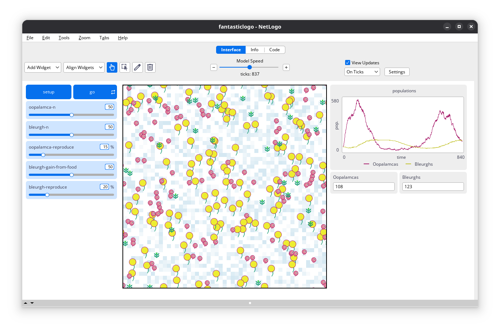

# FantasticLogo

<!-- badges: start -->
[](https://www.repostatus.org/#wip)
[](https://www.gnu.org/licenses/gpl-3.0)
<!-- [](https://www.comses.net/) -->
<!-- [](https://doi.org/) -->
<!-- [](https://fairsoftwarechecklist.net/v0.2?f=31&a=30112&i=32301&r=123) -->
<!-- [](https://fair-software.eu) -->
<!-- badges: end -->

## Overview

`FantasticLogo` is a [NetLogo](https://www.netlogo.org) model for simulating the complex predator-prey dynamics of bleurghs and oopalamcas, two species native to planet Magy's northern hemisphere. It provides a platform for xenobiology research, allowing users to explore how alien species interact, compete, and adapt within an unfamiliar ecosystem. Beyond research, the model also demonstrates integration with the [`LogoClim`](https://github.com/sustentarea/logoclim) NetLogo model, enabling simulations that link species dynamics with planetary climate conditions.

> If you find this project useful, please consider giving it a star! [](https://github.com/danielvartan/fantasticlogo/)



## How It Works

`FantasticLogo` operates on a grid of patches, where each patch represents the soil were bleurghs grow and where oopalamcas roam. Each patch corresponds to a specific geographical area and stores historical data values for precipitation and minimum and maximum temperature.

A oopalamca is a small, purple, creature known for its voracious appetite and distinctive croaking sound. Bleurghs are large, carnivorous plants that can move slowly and capture prey with their funnel-shaped mouths. In the model, oopalamcas represent the prey species, while bleurghs are the predators.

During the simulation, bleurghs grown on the patches depending on current climate conditions. After they hit a certain age, they can capture and prey roaming oopalamcas, controlling their populations. The behavior and interactions of these species are influenced by the climate data associated with each patch. The results can be visualized on a chart that tracks the populations of both species over time.

## Jokes Aside...

<a href="https://www.imdb.com/title/tt0070544/"></a> `FantasticLogo` takes inspiration from the 1973 animated film [La Planète Sauvage](https://www.imdb.com/title/tt0070544/) by [René Laloux](https://www.imdb.com/name/nm0482537). Set on a strange, hypnotic world, it tells of the Draags—towering blue beings who treat humans, known as Oms, as little more than pets.

The model’s dynamics are grounded in the classic [Lotka-Volterra equations](https://danielvartan.github.io/lotka-volterra/), originally formulated by Alfred J. Lotka ([1925](http://archive.org/details/elementsofphysic017171mbp)) and Vito Volterra ([1926](https://www.nature.com/articles/118558a0)), to describe predator–prey interactions. The code builds on Wilensky’s ([1997](http://ccl.northwestern.edu/netlogo/models/WolfSheepPredation)) Wolf Sheep Predation model.

The model was created to serve as an example of integration of climate data from [WorldClim 2.1](https://worldclim.org/) using the [`LogoClim`](https://github.com/sustentarea/logoclim) NetLogo model. The climate data influences the behavior and interactions of the species, adding a layer of complexity to the simulation.

Climate data is based on historical climate data (1951-2024) from WorldClim 2.1 ([Fick & Hijmans, 2017](https://doi.org/10.1002/joc.5086)), related to a box selection of the Amazon region. The data can be reproduced using the Quarto notebooks located in the `qmd` folder of the repository, which are adaptations from the Quarto notebooks provided by the [`LogoClim`](https://github.com/sustentarea/logoclim) model.

## How to Use It

### Setup

To get started, ensure you have [NetLogo](https://www.netlogo.org) installed. This model was developed using NetLogo 7.0.0, so it is recommended to use this version or later.

The model relies on the LevelSpace ([`ls`](https://ccl.northwestern.edu/netlogo/docs/ls.html)) NetLogo extension, that is automatically installed when the model is run for the first time.

#### Downloading the Model

You can download the latest release of the model from its [GitHub
Releases page](https://github.com/danielvartan/fantasticlogo/releases/latest).
For the development version, you can clone or download its [GitHub
repository](https://github.com/danielvartan/fantasticlogo/) directly.

To run the model, make sure to download all files, no only the `nlogox`
folder.

#### Running the Model

Once everything is set, open the `fantasticlogo.nlogox` file located in the
`nlogox` folder to start exploring!

Refer to the `Info` tab in the model for additional details.

## How to Cite

To cite `FantasticLogo` use the following format:

Vartanian, D. (2025). *FantasticLogo: Predator–prey dynamics on planet Magy with NetLogo* \[Computer software\]. <https://doi.org/10.17605/OSF.IO/EAPZU>

A BibTeX entry for LaTeX users is:

``` latex
@Misc{vartanian2025,
  title = {FantasticLogo: Predator–prey dynamics on planet Magy with NetLogo},
  author = {{Daniel Vartanian}},
  year = {2025},
  doi = {10.17605/OSF.IO/EAPZU},
  note = {Computer software}
}
```

## License

[](https://www.gnu.org/licenses/gpl-3.0)

``` text
Copyright (C) 2025 Daniel Vartanian

FantasticLogo is free software: you can redistribute it and/or modify it under the
terms of the GNU General Public License as published by the Free Software
Foundation, either version 3 of the License, or (at your option) any later
version.

This program is distributed in the hope that it will be useful, but WITHOUT ANY
WARRANTY; without even the implied warranty of MERCHANTABILITY or FITNESS FOR A
PARTICULAR PURPOSE. See the GNU General Public License for more details.

You should have received a copy of the GNU General Public License along with
this program. If not, see <https://www.gnu.org/licenses/>.
```
